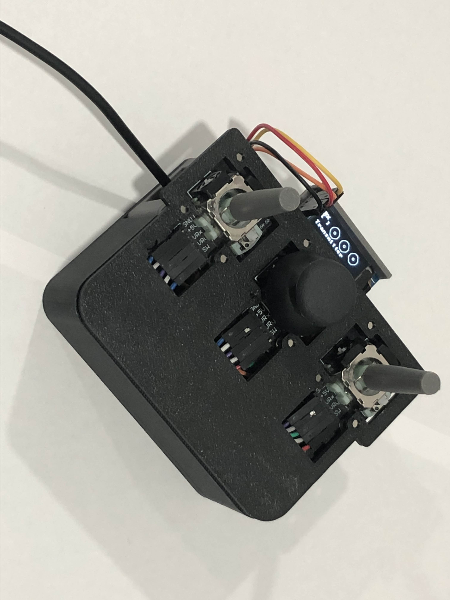

# Remote Controlled Transmitter

Custom ESP32 based remote controlled transmitter for the Micro Copter, designed with real time control, low latency communication, and visual feedback.

---

## Overview
This transmitter interfaces with the Micro Copter via ESP NOW protocol, providing low latency control over analog joysticks and buttons. The firmware uses FreeRTOS on the ESP32 to separate input acquisition from display management, ensuring real-time responsiveness and accurate telemetry.

---

## Hardware 
- Analog joysticks + buttons  
- I2C OLED display (SSD1306) for real time feedback  
- MCU: ESP32 Dual-core Tensilica LX6 @ 240 MHz  

### Interfaces
- ESP NOW for wireless communication  
- GPIO for buttons and status LEDs  
- ADC for analog joystick inputs  

---

## Firmware
- Language: C  
- RTOS: FreeRTOS  
- Dual-core task distribution:
  - **Core 0**: Read joystick/button states, transmit control data to receiver  
  - **Core 1**: Display joystick positions, transmitter/receiver status on OLED  

---

## System Architecture

### Input Interface
- Joysticks and buttons connected via ADC and GPIO  
- Modules: `adc.c/h`, `joystick.c/h`  
- Provides easy access to analog positions and digital button states  

### Wireless Communication
- Protocol: ESP-NOW  
- Sends structured control data to Micro Copter  
- Module: `transmitter.c/h`  

### Display Interface
- OLED display: SSD1306 (I2C)  
- Shows joystick positions, connection status, and transmitter feedback  
- Custom driver: `ssd1306.c/h`  

---

## Features
- Low latency communication with Micro Copter using ESP NOW  
- Dual core FreeRTOS task separation for deterministic performance  
- Real time joystick/button reading and transmission  
- Visual feedback of controls and connection status on OLED  
- Modular driver design for ADC, joysticks, and OLED  

---

## Notes
- Designed for embedded efficiency and low latency performance  
- FreeRTOS ensures reliable separation of input acquisition and display updates  
- Safety failsafes included for lost connection scenarios  
